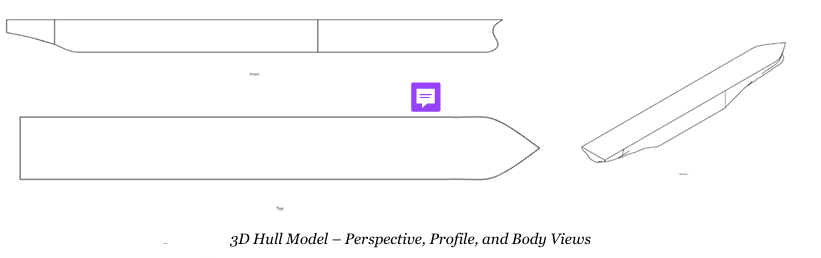
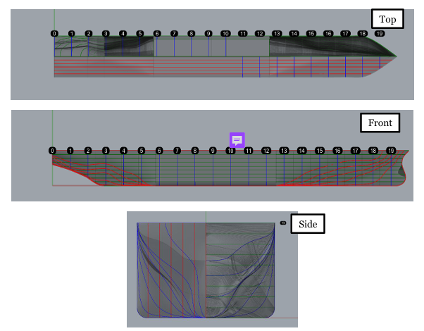
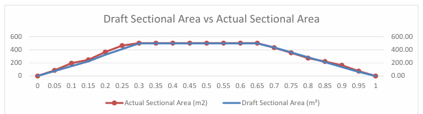
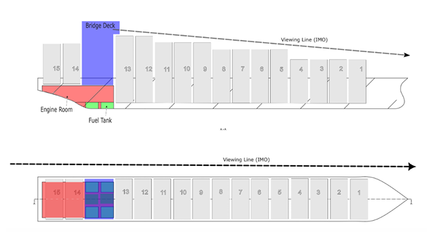
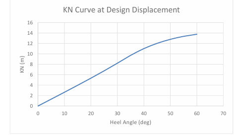
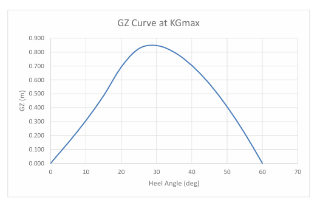

# 5000 TEU Container Vessel — Conceptual Ship Design

Conceptual design of a **5000 TEU container vessel**, covering preliminary sizing, hull-form development, sectional-area verification, general arrangement, hydrostatics, and preliminary intact-stability analysis.

The project combines **ship-design methodology, CAD geometry, Rhino-based engineering analysis, and Python automation**.

> **Project type:** University team project  
> **Design capacity:** 5000 TEU  
> **Primary tools:** Onshape, Rhino, Python

---

## Project Overview

The vessel was developed from initial design requirements through a preliminary engineering workflow:

1. Define principal dimensions and hydrostatic coefficients
2. Develop an initial sectional-area curve
3. Create station-based 3D hull geometry
4. Generate and inspect the lines plan
5. Compare the initial and actual sectional-area distributions
6. Develop a conceptual general arrangement
7. Evaluate hydrostatic properties
8. Perform preliminary KN and GZ stability analysis

## Principal Particulars

| Parameter | Value |
|---|---:|
| Container capacity | 5000 TEU |
| Design speed | 21 kn |
| Design range | 6500 nm |
| Length between perpendiculars, Lpp | 280 m |
| Length overall, LOA | 294 m |
| Beam | 34.8 m |
| Design draught | 14.5 m |
| Depth | 23.925 m |
| Block coefficient, CB | 0.63 |
| Midship coefficient, CM | 0.985 |
| Prismatic coefficient, CP | 0.64 |
| Estimated displacement | 91,236.73 t |

---

## Hull-Form Development

A station-based hull geometry was developed in **Onshape** from the preliminary dimensions and sectional-area distribution.

The geometry was subsequently reviewed and processed in **Rhino**, including generation of stations, waterlines, and buttocks.



### Lines Plan

The lines plan provides a geometric representation of the hull through transverse stations, longitudinal buttocks, and horizontal waterlines.



---

## Sectional-Area Verification

Sectional areas were extracted from the developed hull and compared with the initial design distribution.

The comparison was used to assess whether hull fairing preserved the intended longitudinal distribution of underwater volume.



---

## General Arrangement

A conceptual general arrangement was developed to examine the spatial allocation of major vessel functions, including:

- container bays
- machinery spaces
- fuel tanks
- accommodation and bridge region
- navigation visibility considerations



---

## Hydrostatics and Python Automation

The repository contains Rhino Python scripts supporting geometry-based engineering calculations.

### `hydrostatics.py`

Supports extraction of quantities including:

- submerged volume
- block coefficient
- waterplane area
- center-of-buoyancy information
- transverse metacentric radius
- wetted surface area
- sectional-area distribution

### `kn_stability.py`

Supports KN calculations by evaluating the submerged hull geometry at different heel angles and target displacement.

### `lines_plan_generator.py`

Automates generation of:

- stations
- buttocks
- waterlines

from a closed Rhino hull polysurface.

> The scripts use Rhino-specific Python APIs and are intended to run within the Rhino environment rather than as standalone Python programs.

---

## Preliminary Stability Analysis

A KN curve was evaluated for the vessel at approximately constant displacement.



The project subsequently used the KN results to evaluate a limiting vertical center of gravity and construct a GZ curve.

The reported limiting value was:

**KGmax = 13.064 m**

The resulting GZ curve reached approximately:

**GZmax ≈ 0.85 m at about 30° heel**

and remained positive through the investigated range up to 60°.



---

## Repository Structure

```text
5000-teu-container-vessel-design/
├── README.md
├── .gitignore
├── src/
│   ├── README.md
│   ├── hydrostatics.py
│   ├── kn_stability.py
│   └── lines_plan_generator.py
├── images/
│   ├── README.md
│   ├── hull_3d_model.png
│   ├── hull_lines_isometric.png
│   ├── lines_plan.png
│   ├── sectional_area_comparison.png
│   ├── general_arrangement.png
│   ├── kn_stability_curve.png
│   └── gz_stability_curve.png
├── results/
│   └── README.md
└── docs/
    └── README.md
```

## Tools and Engineering Methods

- Onshape
- Rhino
- Python
- Rhino Python / `rhinoscriptsyntax`
- 3D hull modelling
- Lines-plan generation
- Sectional-area analysis
- Hydrostatic calculations
- Preliminary intact-stability analysis
- KN and GZ curves
- General-arrangement development

---

## Project Scope and Attribution

This work was completed as a **three-person university team project**.

The retained project documentation does not provide a reliable task-by-task breakdown of each team member's individual contribution. Therefore, the repository presents the work as a team project rather than assigning individual ownership of specific work packages.

The original academic report is not included because it contains student identification and administrative information.

This repository contains selected engineering scripts, figures, numerical summaries, and documentation intended to demonstrate the project's technical workflow while avoiding publication of private academic information.
